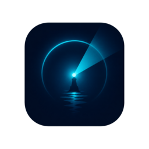

  

# Beacon

[English](README.md)

面向 **Subnautica 2** 的真正专用多人联机方案。你可以拥有自己的 IP 和端口服务器，朋友可直接通过地址加入，存档保存在服务器端，想装 Mod 也没问题。没有好友码大厅，没有点对点连接，也没有四人上限。

_Beacon 是一个社区项目，与 Subnautica 2 的开发者没有任何隶属关系，也未获得其认可或背书。_

> **官方托管：** [SurvivalServers.com](https://www.survivalservers.com/games/subnautica_2/?utm_source=github&utm_medium=readme&utm_campaign=beacon) 提供已预装 Beacon 的 Subnautica 2 服务器。

---

## 目录

- [Beacon 是什么](#beacon-是什么)
- [功能特性](#功能特性)
- [安装](#安装)
- [文档](#文档)
- [源代码](#源代码)
- [版本发布](#版本发布)
- [参与贡献](#参与贡献)
- [许可证](#许可证)
- [鸣谢](#鸣谢)

---

## Beacon 是什么

Beacon 由两个一同发布的组件组成：

- **Beacon Launcher**：每位玩家都需要安装的桌面应用。它支持按 IP 和端口添加服务器、将 Subnautica 2 启动到正确的联机会话、管理你的角色列表，并为管理员提供存档快照 / 恢复 / RCON 控制台面板。以**闭源二进制**形式分发。
- **BeaconServer**：运行在 Windows 主机上的监管程序，与 Subnautica 2 同机部署。它负责进程监管、存档快照、Source A2S 查询、Source RCON，以及采用 HMAC 签名的 HTTP 管理 API。**以 MIT 协议开源**，仓库地址为 [HumanGenome/BeaconServer](https://github.com/HumanGenome/BeaconServer)。

要加入服务器，你只需安装启动器。要进行托管，则需要由托管服务商（或你自己）在 Subnautica 2 安装目录旁运行 BeaconServer。

---

## 功能特性

### 真正的专用服务器
好友通过 IP 和端口即可连接。即使你下线，服务器依然持续运行；游戏世界会保存在服务器磁盘上；当“房主”离开时，也不会发生主机迁移。

### 突破 4 人上限
原版 Subnautica 2 的合作模式上限为 4 人。Beacon 将其传输层替换为 Unreal 标准的监听服务器网络方案，因此同一个世界中可以容纳 6 人、8 人，甚至更多玩家。

### 多角色档案
每位玩家都可以在同一台服务器上保留多个角色。启动器会记住你在不同服务器上使用过哪个角色；服务器则会将每个角色对应的存档分片彼此隔离。

### 存档快照与回滚
Beacon 支持自动创建世界快照，也支持按需手动快照。合档出错、团灭翻车、基地被删？都可以通过启动器的管理员面板回滚。

### 管理员控制台（RCON）
在 `gameplay port + 3` 上提供标准的 Source RCON 监听，可搭配任意标准 RCON 客户端使用。

### 服务器浏览器支持
Beacon 会响应 Source A2S 查询，因此服务器浏览器、监控工具以及 Discord 状态机器人都可以读取你的服务器名称、地图、玩家数量和运行时长。

### Mods
服务端和客户端都可通过 UE4SS 加载 Lua 与 C++ Mod。

---

## 安装

### 前置条件

- **Windows 10 或 11**（64 位）
- 已安装 **Subnautica 2**（Steam、Epic Games 或 Microsoft Store 版本均可）
- 具备让其他人访问服务器的方式：使用托管服务（例如 SurvivalServers），或在你网络中的一台 Windows 主机上完成端口转发

### 第 1 步：安装启动器（每位玩家都需要）

1. 从[最新版本发布页](https://github.com/HumanGenome/Beacon/releases/latest)下载 `BeaconSetup-<version>.exe`。
2. 运行安装程序。由于该二进制尚未进行代码签名，Windows SmartScreen 会弹出警告，此时点击 **More info → Run anyway**。
3. 安装程序会将 Beacon 安装到 `%LOCALAPPDATA%\Beacon\`，并创建开始菜单快捷方式。

### 第 2 步：配置服务器（自托管）

如果你使用的是托管服务，可跳过此步骤。

从[最新版本发布页](https://github.com/HumanGenome/Beacon/releases/latest)下载 `Beacon-Server-Windows-x64-<version>.zip`，解压后编辑 `appsettings.json`，转发 UDP `<port>` 与 `<port>+2`，以及 TCP `<port>+3` 与 `<port>+4`，然后运行 `BeaconServer.exe`。完整自托管说明请参阅 [BeaconServer README](https://github.com/HumanGenome/BeaconServer#installation)。

### 第 3 步：连接服务器

打开启动器，点击 **Add server**，输入主机地址、游戏端口以及可选的管理员密码，然后点击 **Connect**。Subnautica 2 会自动启动并将你带入对应会话。

---

## 文档

- **[管理员与 RCON 指南](https://github.com/HumanGenome/BeaconServer/blob/main/docs/ADMIN.md)**：启动器管理员面板、RCON 命令参考、HTTP 管理 API
- **[Mod 制作指南](https://github.com/HumanGenome/BeaconServer/blob/main/docs/MODS.md)**：Lua 与 C++ Mod 的入口点说明
- **[BeaconServer 源码](https://github.com/HumanGenome/BeaconServer)**：服务端代码，采用 MIT 协议

---

## 源代码

| 组件 | 源代码 | 许可证 |
|---|---|---|
| **BeaconServer**（主机监管程序 + API） | [HumanGenome/BeaconServer](https://github.com/HumanGenome/BeaconServer) | MIT |
| **Beacon Launcher**（桌面应用 + 游戏侧插件） | 闭源 | 专有二进制，可免费下载和使用，详见 [LICENSE](LICENSE) |

这种拆分是有意为之：服务端部分（任何主机运行 Beacon 时都会用到）完全开源且可自由分叉；启动器部分（包含 UE5 运行时插桩逻辑）目前暂时闭源，以便项目在稳定阶段保持可控，未来可能会调整。

---

## 版本发布

两个组件的所有版本都会发布在当前仓库的 [Releases 页面](https://github.com/HumanGenome/Beacon/releases)。每个版本都会附带：

- `BeaconSetup-<version>.exe`：Beacon Launcher 安装程序
- `Beacon-Server-Windows-x64-<version>.zip`：BeaconServer 二进制文件

对于只需要服务端的自托管用户，BeaconServer 也会在它自己的 [Releases 页面](https://github.com/HumanGenome/BeaconServer/releases) 单独发布。

---

## 参与贡献

欢迎通过 [HumanGenome/BeaconServer](https://github.com/HumanGenome/BeaconServer) 为**服务端**提交 Issue 和 Pull Request。对于**启动器**，请在当前仓库的 [Issues](https://github.com/HumanGenome/Beacon/issues) 中提交缺陷反馈和功能建议，但由于源代码尚未公开，暂不接受针对启动器的 PR。

---

## 许可证

本仓库中的内容（README、文档等）采用 MIT 协议授权，详见 [LICENSE](LICENSE)。

发布版本中附带的 Beacon Launcher 二进制程序为**闭源软件**。你可以免费下载和使用，但不得重新分发、修改、反编译或逆向工程该启动器二进制。完整条款请以启动器安装程序中的 EULA 为准。

BeaconServer（主机侧监管程序）在 [HumanGenome/BeaconServer](https://github.com/HumanGenome/BeaconServer) 中单独以 MIT 协议授权。

---

## 鸣谢

- [UE4SS](https://github.com/UE4SS-RE/RE-UE4SS)：Unreal Engine 脚本与 Mod 框架
- [Avalonia](https://avaloniaui.net/)：启动器所使用的跨平台 .NET UI 框架